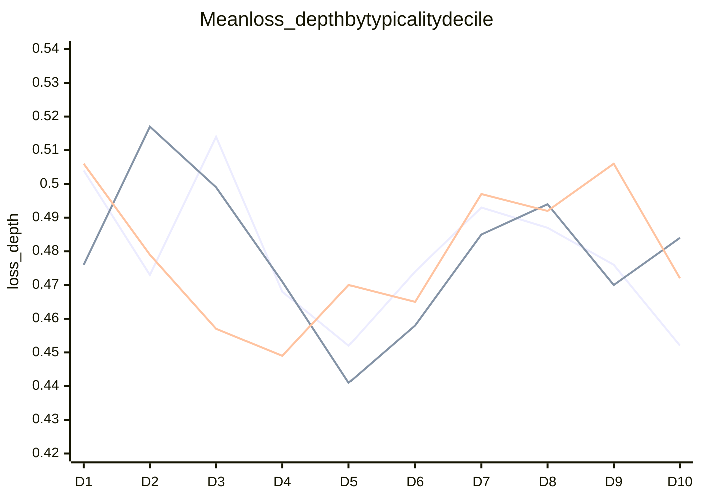

# Cluster typicality vs eval loss

OLS of how typical each of **993 eval scenes** is for its cluster, against that scene's mean loss. Features: `6k_features_layers.npz`.

**Finding:** fairly random, including k-means. Typicality explains ~0.3% of loss on the Leiden joint sheets and ~0% on nearest assignment and spherical k-means. Cluster mean/median `loss_depth` also do not track typicality or size.

| Sheet | Pearson r |
|---|---|
| Leiden joint · `loss_depth` | −0.058 |
| Leiden joint · `loss` | −0.057 |
| nearest · `loss_depth` | −0.009 |
| k-means joint · `loss_depth` | −0.005 |

## Method

- **Leiden joint typicality:** mean cosine to other members of the jointly clustered Leiden community (78 clusters). Sheets: `6k_features_layers_joint_loss_depth.html`, `6k_features_layers_joint_loss.html`.
- **Nearest typicality:** cosine to the unit-normalized training-cluster centroid (13 clusters). Sheet: `6k_features_layers_nearest_loss_depth.html`.
- **K-means joint typicality:** mean cosine to other members of the jointly clustered spherical k-means community (k=100). Sheet: `6k_features_layers_joint_kmeans_k100_loss_depth.html`.
- **Loss:** per-scene mean over 3 eval repeats from `runs/small-v5_default/eval/windows-small-v5-latest.jsonl`.
- Scene-level regression is `loss ~ typicality` (ordinary least squares). Spearman ρ is rank correlation on the same pairs.

## OLS · loss ~ typicality

n = 993 eval scenes for every row.

| Sheet | Slope | Intercept | R² | Spearman ρ | p (slope) |
|---|---|---|---|---|---|
| Leiden joint · `loss_depth` | −0.185 | 0.533 | 0.34% | −0.048 | 0.066 |
| Leiden joint · `loss` | −0.431 | 1.389 | 0.33% | −0.059 | 0.071 |
| nearest · `loss_depth` | −0.015 | 0.486 | 0.01% | −0.034 | 0.78 |
| k-means joint · `loss_depth` | −0.012 | 0.484 | 0.00% | +0.031 | 0.87 |

Leiden slopes are weakly negative and miss p = 0.05. Nearest and k-means are flat. Moving from the least- to most-typical scene shifts predicted Leiden `loss_depth` by only ~0.10 against a 0.13–2.60 range.

## Mean loss by typicality decile

Equal-count bins of typicality (D1 = least typical, ~99 scenes each). If fringe scenes were harder, these would fall left-to-right. They wobble around the overall mean instead.

Overall mean `loss_depth` = 0.479. Overall mean `loss` = 1.263.

| Decile | Leiden joint `loss_depth` | nearest `loss_depth` | k-means joint `loss_depth` | Leiden joint `loss` |
|---|---|---|---|---|
| D1 | 0.504 | 0.476 | 0.506 | 1.295 |
| D2 | 0.473 | 0.517 | 0.479 | 1.290 |
| D3 | 0.514 | 0.499 | 0.457 | 1.303 |
| D4 | 0.468 | 0.471 | 0.449 | 1.237 |
| D5 | 0.452 | 0.441 | 0.470 | 1.197 |
| D6 | 0.474 | 0.458 | 0.465 | 1.243 |
| D7 | 0.493 | 0.485 | 0.497 | 1.381 |
| D8 | 0.487 | 0.494 | 0.492 | 1.297 |
| D9 | 0.476 | 0.470 | 0.506 | 1.234 |
| D10 | 0.452 | 0.484 | 0.472 | 1.152 |

Series order: Leiden joint, nearest, k-means joint.

## Robustness

| Subset | Leiden `loss_depth` r | Leiden `loss` r | nearest `loss_depth` r | k-means `loss_depth` r |
|---|---|---|---|---|
| All 993 | −0.058 | −0.057 | −0.009 | −0.005 |
| Drop top 2% loss | −0.031 | −0.050 | −0.028 | +0.025 |
| Cluster size ≥ 20 | −0.050 | −0.025 | −0.017 | −0.005 |
| log(loss) | −0.059 | −0.070 | −0.012 | +0.012 |

Every cut stays |r| < 0.07. The Leiden joint hint is a handful of high-loss fringe scenes; clip them and even that goes away. K-means never leaves noise.

## K-means cluster mean and median

83 of 100 spherical k-means clusters received any eval scene. Values are mean/median `loss_depth` over that cluster's eval members.

Cluster-level OLS, n_eval ≥ 3 (58 clusters):

- mean typicality vs **mean** loss: r = −0.018 (p = 0.89)
- mean typicality vs **median** loss: r = −0.093 (p = 0.49)
- weighted by n_eval: r = +0.05
- cluster size vs mean loss: r ≈ 0

Two tiny disasters pull a few means up: c69 = 1.58 (n_eval = 2), c87 = 1.20 (n_eval = 1). Medians stay ordinary.

### Ten clusters with the most eval scenes

Means sit between 0.38 and 0.58 with no size or typicality gradient.

| Cluster | Size | n eval | Typ. mean | Mean `loss_depth` | Median `loss_depth` |
|---|---|---|---|---|---|
| 4 | 102 | 97 | 0.371 | 0.410 | 0.382 |
| 13 | 79 | 77 | 0.347 | 0.464 | 0.453 |
| 34 | 60 | 55 | 0.261 | 0.464 | 0.445 |
| 3 | 105 | 53 | 0.391 | 0.509 | 0.436 |
| 11 | 82 | 50 | 0.389 | 0.576 | 0.511 |
| 46 | 51 | 49 | 0.351 | 0.497 | 0.492 |
| 10 | 82 | 44 | 0.430 | 0.583 | 0.556 |
| 71 | 37 | 33 | 0.353 | 0.460 | 0.449 |
| 43 | 52 | 32 | 0.287 | 0.462 | 0.457 |
| 44 | 51 | 30 | 0.336 | 0.382 | 0.392 |

### All k-means clusters with eval scenes

Ordered largest → smallest (same order as the contact sheet). Mean = median when n_eval = 1.

| Cluster | Size | n eval | Typ. mean | Mean `loss_depth` | Median `loss_depth` |
|---|---|---|---|---|---|
| 0 | 173 | 2 | 0.422 | 0.624 | 0.624 |
| 1 | 106 | 1 | 0.184 | 0.357 | 0.357 |
| 3 | 105 | 53 | 0.391 | 0.509 | 0.436 |
| 4 | 102 | 97 | 0.371 | 0.410 | 0.382 |
| 5 | 99 | 15 | 0.324 | 0.634 | 0.612 |
| 7 | 89 | 16 | 0.441 | 0.545 | 0.492 |
| 8 | 87 | 9 | 0.278 | 0.412 | 0.422 |
| 9 | 85 | 14 | 0.439 | 0.361 | 0.351 |
| 10 | 82 | 44 | 0.430 | 0.583 | 0.556 |
| 11 | 82 | 50 | 0.389 | 0.576 | 0.511 |
| 12 | 81 | 1 | 0.276 | 0.454 | 0.454 |
| 13 | 79 | 77 | 0.347 | 0.464 | 0.453 |
| 15 | 77 | 3 | 0.316 | 0.477 | 0.354 |
| 16 | 76 | 3 | 0.236 | 0.627 | 0.549 |
| 17 | 74 | 18 | 0.474 | 0.523 | 0.529 |
| 19 | 72 | 6 | 0.342 | 0.311 | 0.298 |
| 20 | 71 | 9 | 0.276 | 0.466 | 0.432 |
| 21 | 71 | 20 | 0.546 | 0.430 | 0.364 |
| 22 | 69 | 16 | 0.382 | 0.504 | 0.446 |
| 24 | 67 | 1 | 0.271 | 0.512 | 0.512 |
| 25 | 66 | 4 | 0.284 | 0.562 | 0.483 |
| 26 | 65 | 3 | 0.307 | 0.270 | 0.273 |
| 27 | 64 | 6 | 0.281 | 0.489 | 0.406 |
| 28 | 63 | 3 | 0.322 | 0.381 | 0.391 |
| 29 | 63 | 2 | 0.300 | 0.321 | 0.321 |
| 30 | 63 | 8 | 0.294 | 0.561 | 0.572 |
| 31 | 63 | 13 | 0.355 | 0.483 | 0.380 |
| 34 | 60 | 55 | 0.261 | 0.464 | 0.445 |
| 35 | 60 | 2 | 0.270 | 0.301 | 0.301 |
| 36 | 60 | 7 | 0.251 | 0.344 | 0.326 |
| 37 | 59 | 2 | 0.443 | 0.778 | 0.778 |
| 38 | 58 | 12 | 0.408 | 0.557 | 0.496 |
| 39 | 55 | 14 | 0.487 | 0.448 | 0.419 |
| 40 | 54 | 8 | 0.231 | 0.440 | 0.426 |
| 42 | 53 | 4 | 0.326 | 0.421 | 0.436 |
| 43 | 52 | 32 | 0.287 | 0.462 | 0.457 |
| 44 | 51 | 30 | 0.336 | 0.382 | 0.392 |
| 45 | 51 | 1 | 0.202 | 0.564 | 0.564 |
| 46 | 51 | 49 | 0.351 | 0.497 | 0.492 |
| 47 | 50 | 3 | 0.236 | 0.567 | 0.489 |
| 48 | 50 | 1 | 0.263 | 0.369 | 0.369 |
| 49 | 49 | 7 | 0.262 | 0.535 | 0.583 |
| 50 | 49 | 21 | 0.406 | 0.418 | 0.398 |
| 51 | 49 | 6 | 0.367 | 0.499 | 0.524 |
| 52 | 48 | 7 | 0.305 | 0.533 | 0.559 |
| 53 | 48 | 10 | 0.356 | 0.369 | 0.368 |
| 54 | 47 | 13 | 0.323 | 0.463 | 0.509 |
| 57 | 44 | 9 | 0.372 | 0.497 | 0.477 |
| 58 | 42 | 5 | 0.337 | 0.358 | 0.372 |
| 60 | 42 | 3 | 0.344 | 0.404 | 0.370 |
| 61 | 41 | 8 | 0.494 | 0.408 | 0.406 |
| 62 | 41 | 8 | 0.242 | 0.454 | 0.423 |
| 64 | 40 | 1 | 0.197 | 0.553 | 0.553 |
| 65 | 40 | 6 | 0.231 | 0.357 | 0.401 |
| 66 | 39 | 14 | 0.492 | 0.458 | 0.443 |
| 67 | 39 | 2 | 0.188 | 0.384 | 0.384 |
| 68 | 39 | 12 | 0.551 | 0.560 | 0.431 |
| 69 | 38 | 2 | 0.242 | 1.582 | 1.582 |
| 70 | 37 | 1 | 0.323 | 0.631 | 0.631 |
| 71 | 37 | 33 | 0.353 | 0.460 | 0.449 |
| 73 | 37 | 2 | 0.359 | 0.551 | 0.551 |
| 74 | 36 | 12 | 0.267 | 0.371 | 0.360 |
| 75 | 35 | 6 | 0.314 | 0.638 | 0.451 |
| 76 | 35 | 4 | 0.315 | 0.611 | 0.456 |
| 77 | 35 | 6 | 0.365 | 0.523 | 0.394 |
| 78 | 34 | 2 | 0.160 | 0.491 | 0.491 |
| 79 | 34 | 2 | 0.220 | 0.522 | 0.522 |
| 80 | 32 | 2 | 0.383 | 0.456 | 0.456 |
| 82 | 32 | 2 | 0.284 | 0.415 | 0.415 |
| 83 | 32 | 2 | 0.247 | 0.564 | 0.564 |
| 84 | 31 | 6 | 0.226 | 0.414 | 0.430 |
| 86 | 30 | 8 | 0.452 | 0.384 | 0.355 |
| 87 | 28 | 1 | 0.214 | 1.199 | 1.199 |
| 88 | 26 | 5 | 0.297 | 0.796 | 0.533 |
| 89 | 26 | 13 | 0.403 | 0.480 | 0.457 |
| 90 | 23 | 2 | 0.204 | 0.474 | 0.474 |
| 91 | 22 | 12 | 0.340 | 0.495 | 0.474 |
| 92 | 21 | 2 | 0.252 | 0.307 | 0.307 |
| 93 | 19 | 1 | 0.341 | 0.776 | 0.776 |
| 94 | 16 | 14 | 0.269 | 0.463 | 0.454 |
| 95 | 15 | 5 | 0.211 | 0.517 | 0.473 |
| 96 | 14 | 1 | 0.258 | 0.544 | 0.544 |
| 98 | 12 | 1 | 0.199 | 0.378 | 0.378 |

The remaining 17 clusters (2, 6, 14, 18, 23, 32, 33, 41, 55, 56, 59, 63, 72, 81, 85, 97, 99) are train-only and have no eval loss.
